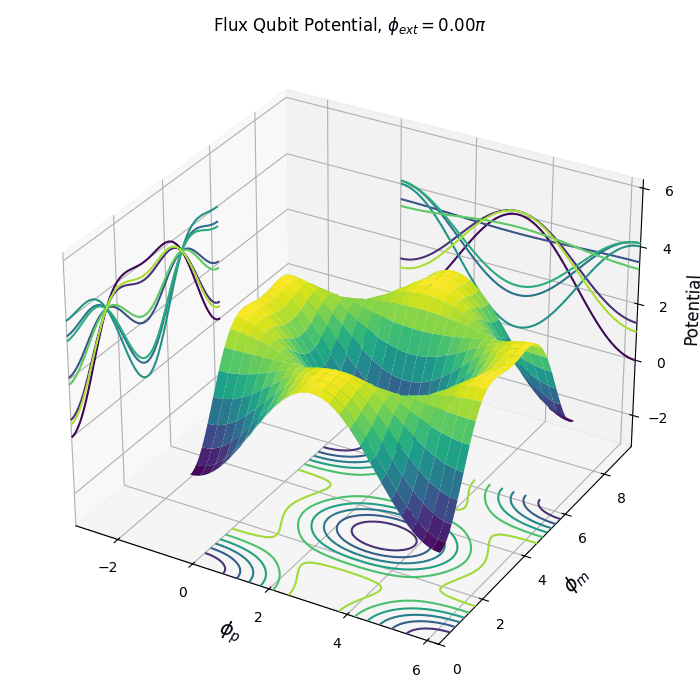

# Animations for Plots

A Python package to create animated plots using Matplotlib.

## Example Animation



See more examples in the [examples directory](./examples).

## Features

- Create 3D surface of flux qubit potential.
- Create 2D colormap of flux qubit potential.
- Customizable animation parameters (frames, figure size, colormap).
- Save animations as MP4 or GIF files.
- Command-line interface for easy usage.
- Modular design for easy extension and customization.

## Installation

```bash
pip install animations-for-plots
```

## Usage

### Command-Line Interface

```bash
pan --help
```

Simple usage to create a 3D animation of the flux qubit potential:

```bash
pan --type 3d --output my_qubit_animation.gif
```
